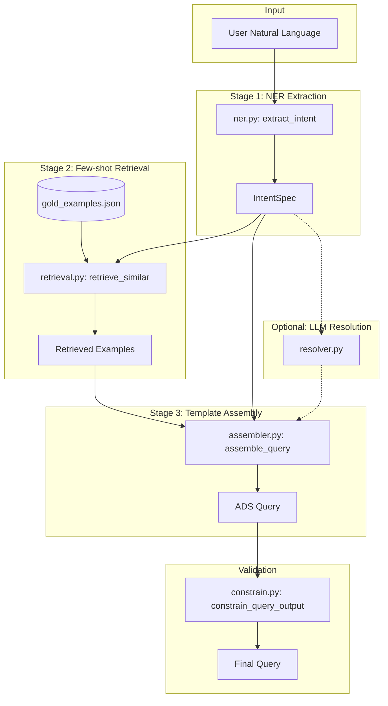

# Hybrid NER Pipeline Architecture

This document describes the hybrid NER + few-shot retrieval + template assembly pipeline for converting natural language to ADS/SciX search queries.

## Why This Architecture?

The previous end-to-end fine-tuned model (Qwen3-1.7B) learned to conflate natural language words with ADS operator syntax, producing malformed outputs like:

```
# BAD: Model conflated "citing" topic with citations() operator
citations(abs:referencesabs:stellar spectra)
```

The hybrid pipeline fixes this by separating concerns:

1. **NER** extracts structured intent (no query syntax generated)
2. **Retrieval** finds similar gold examples for pattern guidance
3. **Assembler** deterministically builds valid queries from validated building blocks
4. **Resolver** (optional) uses LLM only for ambiguous paper reference resolution

## Architecture Diagram



## Data Flow

### Stage 1: NER Extraction (`ner.py`)

Converts natural language to a structured `IntentSpec`:

```python
input: "refereed papers on exoplanets by Seager since 2020"

output: IntentSpec(
    free_text_terms=["exoplanets"],
    authors=["Seager"],
    year_from=2020,
    year_to=2026,
    property={"refereed"},
    operator=None  # No operator triggered
)
```

**Key principle**: Operator is set ONLY when explicit patterns match (see Operator Gating below).

### Stage 2: Retrieval (`retrieval.py`)

Finds similar gold examples using BM25-like scoring with feature boosting:

- Token overlap with IDF weighting
- +5.0 boost for exact operator match
- +2.0 boost for author presence match
- +1.5 boost for year/doctype/property matches

### Stage 3: Assembly (`assembler.py`)

Deterministically constructs the query from validated building blocks:

```python
# Each field type has a dedicated builder
author:"Seager" abs:"exoplanets" pubdate:[2020 TO 2026] property:refereed
```

- All enum values validated against `FIELD_ENUMS`
- Multi-word phrases automatically quoted
- Operators wrap the entire base query (at most one)

### Optional: LLM Resolution (`resolver.py`)

Called ONLY when:
1. Operator requires a target (citations/references/similar)
2. No explicit bibcode provided
3. Text contains ambiguous patterns ("this paper", "famous paper about X")

## IntentSpec Fields

| Field | Type | Description |
|-------|------|-------------|
| `free_text_terms` | `list[str]` | Topic phrases for `abs:`/`title:` |
| `authors` | `list[str]` | Author names |
| `affiliations` | `list[str]` | Institutions for `aff:` |
| `objects` | `list[str]` | Astronomical objects |
| `year_from`, `year_to` | `int \| None` | Year range for `pubdate:` |
| `doctype` | `set[str]` | Document types (must be in DOCTYPES) |
| `property` | `set[str]` | Properties (must be in PROPERTIES) |
| `database` | `set[str]` | Database collections |
| `bibgroup` | `set[str]` | Bibliographic groups |
| `esources` | `set[str]` | Electronic source types |
| `data` | `set[str]` | Data archive sources |
| `operator` | `str \| None` | Wrapper operator (citations, references, etc.) |
| `operator_target` | `str \| None` | Optional bibcode for operator |
| `raw_user_text` | `str` | Original input (for debugging) |
| `confidence` | `dict[str, float]` | Confidence scores per field |

## Operator Gating Rules

**CRITICAL**: Operators are set ONLY when explicit patterns match.

### citations operator
| Pattern | Triggers |
|---------|----------|
| "papers citing X" | ✅ Yes |
| "cited by X" | ✅ Yes |
| "who cited X" | ✅ Yes |
| "citing practices" | ❌ No (topic) |
| "papers about citing" | ❌ No (topic) |

### references operator
| Pattern | Triggers |
|---------|----------|
| "references of X" | ✅ Yes |
| "bibliography of X" | ✅ Yes |
| "papers referenced by X" | ✅ Yes |
| "about references" | ❌ No (topic) |
| "reference materials" | ❌ No (topic) |

### similar operator
| Pattern | Triggers |
|---------|----------|
| "similar to this paper" | ✅ Yes |
| "papers like X" | ✅ Yes |
| "find similar" | ✅ Yes |
| "similar results" | ❌ No (topic) |

### trending operator
| Pattern | Triggers |
|---------|----------|
| "trending papers on X" | ✅ Yes |
| "what's hot in X" | ✅ Yes |
| "popular papers about X" | ✅ Yes |
| "trending topics" | ❌ No (topic) |

### useful operator
| Pattern | Triggers |
|---------|----------|
| "most useful papers on X" | ✅ Yes |
| "useful papers about X" | ✅ Yes |
| "useful information" | ❌ No (topic) |

### reviews operator
| Pattern | Triggers |
|---------|----------|
| "review articles on X" | ✅ Yes |
| "reviews of X" | ✅ Yes |
| "paper review" | ❌ No (topic) |

## Synonym Maps

The NER uses synonym maps to convert user-friendly terms to valid enum values.

### Property Synonyms
| User Input | Maps To |
|------------|---------|
| "refereed", "peer reviewed" | `refereed` |
| "open access", "oa" | `openaccess` |
| "arxiv", "preprint" | `eprint` |

### Doctype Synonyms
| User Input | Maps To |
|------------|---------|
| "paper", "article" | `article` |
| "thesis", "dissertation" | `phdthesis` |
| "conference", "proceedings" | `inproceedings` |
| "software", "code" | `software` |

### Bibgroup Synonyms
| User Input | Maps To |
|------------|---------|
| "Hubble" | `HST` |
| "Webb", "James Webb" | `JWST` |
| "Sloan" | `SDSS` |
| "gravitational waves" | `LIGO` |

## How to Add New Operators

1. Add operator to `OPERATORS` frozenset in `intent_spec.py`
2. Add gating patterns to `OPERATOR_PATTERNS` in `ner.py`
3. Add removal patterns to `OPERATOR_REMOVAL_PATTERNS` in `ner.py`
4. Add assembly logic in `assembler.py` `_wrap_with_operator()`
5. Add unit tests for positive AND negative pattern matching
6. Add regression tests in `tests/regression/test_operator_conflation.py`

## How to Add New Enum Synonyms

1. Add mapping to appropriate `*_SYNONYMS` dict in `ner.py`:
   - `PROPERTY_SYNONYMS`
   - `DOCTYPE_SYNONYMS`
   - `BIBGROUP_SYNONYMS`
   - `DATABASE_SYNONYMS`
2. Use word boundary matching (patterns already do this)
3. Add unit test in `tests/test_ner.py`

## How to Debug Pipeline Failures

### 1. Check the IntentSpec

```python
from finetune.domains.scix.pipeline import process_query

result = process_query("your query here")
print(result.intent.to_json())
print(result.debug_info)
```

### 2. Check if operator was incorrectly triggered

Look for `operator` field in IntentSpec. If set unexpectedly, the gating pattern needs adjustment in `ner.py`.

### 3. Check if enum values were dropped

Compare IntentSpec enum fields with final query. If values are missing, they may have been filtered by `constrain_query_output()`.

### 4. Check retrieval examples

```python
print(result.retrieved_examples)
```

If poor examples are retrieved, consider adjusting boosting weights in `retrieval.py`.

### 5. Run regression tests

```bash
mise run test tests/regression/
```

## Troubleshooting

### "citationsabs:" or similar malformed patterns

**Cause**: End-to-end model is being used instead of pipeline.

**Fix**: Ensure the API is calling `process_query()` from `pipeline.py`, not the fine-tuned model directly.

### Operator not being triggered

**Cause**: User phrasing doesn't match any gating pattern.

**Fix**: Add new pattern to `OPERATOR_PATTERNS` in `ner.py`. Be careful to only match explicit operator intent.

### Valid enum value being dropped

**Cause**: Value not in FIELD_ENUMS or case mismatch.

**Fix**: Check `field_constraints.py` for valid values. Assembler uses case-insensitive matching.

### Pipeline taking too long

**Cause**: LLM resolver being called when it shouldn't be.

**Fix**: Check `needs_resolution()` gating in `resolver.py`. Most queries should NOT trigger LLM.

## Latency Targets

| Component | Target | Typical |
|-----------|--------|---------|
| NER Extraction | < 10ms | ~0.1ms |
| Retrieval (k=5) | < 20ms | ~5ms |
| Assembly | < 5ms | ~0.05ms |
| Full Pipeline (no LLM) | < 50ms local | ~5ms |
| Full Pipeline (Modal warm) | < 200ms | ~20ms |
| LLM Fallback (if triggered) | < 1000ms | ~500ms |

## Key Files

| File | Purpose |
|------|---------|
| `intent_spec.py` | IntentSpec dataclass definition |
| `ner.py` | Rules-based NER with operator gating |
| `retrieval.py` | Few-shot retrieval from gold_examples |
| `assembler.py` | Deterministic query assembly |
| `resolver.py` | Optional LLM for paper resolution |
| `pipeline.py` | Main orchestration |
| `field_constraints.py` | FIELD_ENUMS for validation |
| `constrain.py` | Post-processing safety filter |
